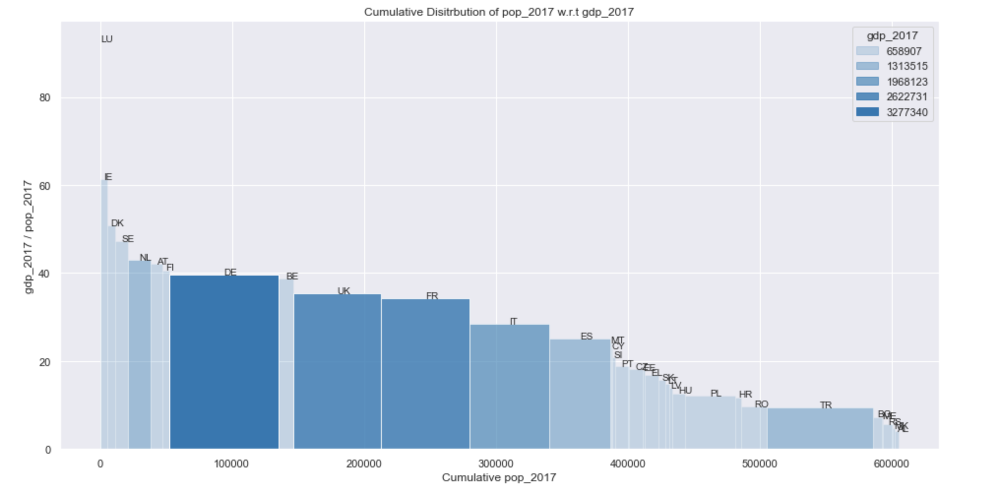

# area_plots_gdp_pop

These functions help visulaize the relationship between cumulative GDP, population, GDP/capita and population/GDP. The x-axis shows the cumulatie value of the x_feature and the y-axis shows the slope. The area of a particular rectangle corresponds to the value of the y_feature. This representation enables a clearer
understanding of the vairables at hand.

As can be seen from the plot above, the x-axis shows the cumulative population of Europe divded along country populations. The y-axis shows the gdp/capita of each country. When multiplying GDP/capita by population you end up with total GDP. The area of each rectangle corresponds to that country's total GDP. The areas of the rectangles are shaded and divided into 5 shades where the strongest shade signifies a higher area (higher GDP)
